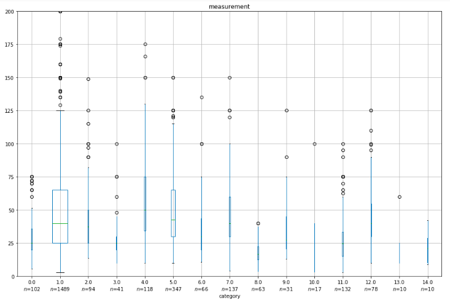

## More Pandas Patterns for ETL and EDA

This post for my own reference continues the themes of and [earlier blog post](https://medium.com/@davidmasse8/helpful-plotting-and-pandas-patterns-80fd82b2b88b).  Please see basic Python imports there as well.


### Uploading Multiple Files to One Dataframe

The following reads and combines all the CSV files in the `/data` folder of the current directory - assuming they all have the same number of columns with the same names in the same order with the same type of data in each column:

```
import glob
df = pd.concat([pd.read_csv(file) for file in glob.glob('./data/*')], ignore_index = True)
```

The above tacks the rows from each CSV file onto the bottom of the dataframe, but they could also be combined (if they have the same number of rows) "horizontally" (i.e. by column): `df = pd.concat([pd.read_csv(file) for file in glob.glob('./data/*')], axis = 1, sort = False)`


### More Initial Checks

Missing values: Note that when using expressions like `df.isnull().sum()` to count missing values, `isnull()` is an alias for `isna()`, which could just as easily be used.  Both `NULL` and `NA` (different in R) in Pandas refer to the underlying Numpy's `NaN`.

Use `.notna()` to keep only rows where a particular column is not null: `df = df[df.column.notna()]`

Use `.fillna()` as way to interpret missing values in a way that makes sense for the dataframe at hand:
`df['column'] = df['column'].fillna(X)`.  If the column has numeric values, `X` here might be zero if missing values should really mean "none."  If the column has categorical values, `X` could a new category, perhaps `"other"`.


### Cleaning and Custom Pivoting the DataFrame

Rename columns (or indices) from 'A' to 'B' and from 1 to 2 with a dictionary: `df.rename(columns = {'A': 'B', 1: 2}, inplace = True)`

Take only the numbers in a string that represents a price (and divide by 100 to get dollars instead of cents, for example):
`df['column'] = df['column'].map(lambda string: float(''.join([char for char in string if char.isdigit()]))/100)`

Or just take out instances of `$` with `lambda string: string.replace('$', '')`

The ternary operator can help with these re-formatting lambda functions.  This one operates on a column of lists to change any list containing an empty string (and nothing else) to an empty list:  `df['lists'] = df['lists'].map(lambda one_list: (one_list, [])[one_list == ['']])`

Why would one have a column of lists?  The lists might contain the various categorical values an observation takes on.  A shirt could be `blue`, `green`, or `beige` or any combination of these colors, so the row for a particular shirt could have `['green', 'beige']` in the `color(s)` column.  But what if we want a column for each color so that, in our green-and-beige shirt's row, the `beige` column and the `green` column indicate `True` or 1 while the `blue` column indicates `False` or 0.  

The normal Pandas `.pivot()` method to "un-melt" or "cast" the dataframe (as in R's `reshape` package) will not work because it would make a new column for each distinct list in the original column.  Instead we need a new column for each distinct term in the union of all the lists in the original column.  It could be handled using `sklearn`'s `MultiLabelBinarizer`, but to keep things simpler, we use `pandas.Series.str.get_dummies`.  We first join each list into one string with list items separated by `|`, the separator that `str.get_dummies()` then assumes when it assigns names to the new columns: `cast_df = df['lists'].str.join('|').str.get_dummies()`


### ETL Vignette: Create a Dataframe from Variable-Length Data with Alternate Labels for the Same Concept/Column

If you are extracting values one by one from a website's code (or any data file that is flexibly organized), sometimes, for each record, there could be a variable number of values given (those omitted from the maximal set are presumed 'NA').  The labels for the values, which are harvested at the same time, are contained in each record in the same list items as the corresponding values.  However, one of the values (an integer) is sometimes labeled with the singular "Job" and other times with the plural "Jobs."

The function below would run many times - once for each row of the dataframe to be compiled.  It first makes a dictionary that will be output to form a row in the dataframe.  It then makes another dictionary (this could be defined globally or passed into the function) called `switcher` that translates both "Jobs" and "Job" to "jobs" along with the other possible labels.  The HTML is parsed with Selenium as the website in question does not accept the get requests that Beautiful Soup works with.

```
def get_properly_labeled_list_items():
    output = {'hours': 'NA',
            'jobs': 'NA',
            'earned': 'NA'}
    switcher = {'Total earned': 'earned',
               'Jobs': 'jobs',
               'Job': 'jobs',
               'Hours worked': 'hours'}
    # list_of_list_items is a Python list of HTML 'li' (list item) elements containing the values and labels we want
    list_of_list_items = driver.find_element_by_class_name('cfe-aggregates').find_element_by_tag_name('ul').find_elements_by_tag_name('li')
    # the first element was always the same in this example, and extracted elsewhere, so we start with the second
    for li list_of_list_items[1:]:
        # pick out the label
        label = li.find_element_by_class_name('text-muted').text
        # look up the label in the switcher dictionary to find a key in the dictionary called 'output',
        # pick out the value in the HTML (h3 text), and assign it to the key just looked up:
        output[switcher[label]] = li.find_element_by_tag_name('h3').text
    return output
```


### Fancy Grouped Boxplot

Here's a way (adapted from examples found online) to make a grouped boxplot (on a common vertical scale), with the width of the box proportional to the number of samples in that category.  It also displays the number of samples in each category along the horizontal axis.



```
# Here we're extracting a two-column dataframe with just the group assignment and measurements series
# from any larger dataframe containing them
# Numpy, not Pandas, so use .stack instead of .concat
for_box = np.stack((category, measurement), axis = 1)
box_df = pd.DataFrame(for_box)
box_df.columns = ['category', 'measurement']
dfg = box_df.groupby('category')
# Iterate through the categories, counting the number of observations in each
counts = [len(v) for k, v in dfg]
total = float(sum(counts))
categories = len(counts)
# Scale widths to the number of observations in a category as a percentage of the number of all observations
widths = [c/total for c in counts]  
cax = box_df.boxplot(column = 'measurement', by = 'category', figsize = (15,10))
cax.set_xticklabels(['%s\n$n$=%d'%(k, len(v)) for k, v in dfg])
# Range below to be set to make sense for the data
cax.set_ylim([0, 200])
```
